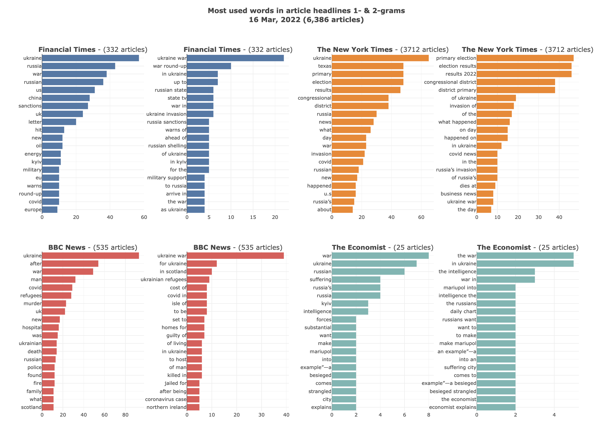

# Visualize the most used words in news headlines, taken from Google News sitemaps

1. Download XML news sitemaps
2. Exctract words from headlines (1 and 2-grams)
3. Visualize with bar charts

## Click to play with the notebook: 

